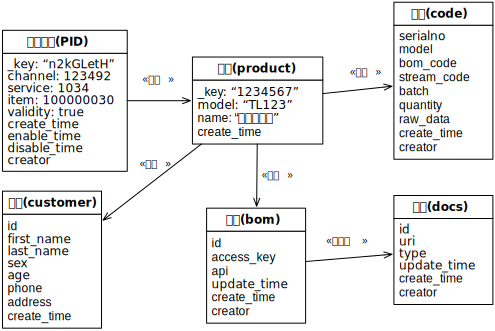
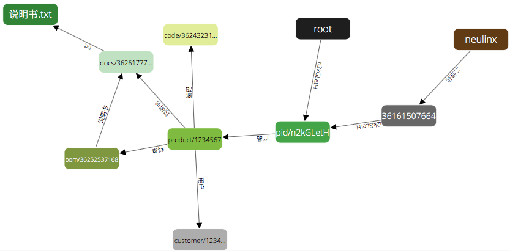

# Data Engine Graph API 应用指南

## 数据模型



上图是一个通过产品二维码检索该产品相关信息的数据模型。图中以该产品为中心，关联二维码编码信息、生产编码、零部件清单、说明书及用户信息。上图可以认为是一个复杂网状数据结构中的一个局部。

传统的数据库设计面向的作为数据集合的表进行设计，而**DataEngine** 采用的是Graph结构的设计，面向具体的数据实体和各个数据实体之间的关联。也就是说DataEngine数据设计强调个性，传统数据设计则强调共性。上图并不是传统数据库表及表间关联示意图，是个体之间的关系图。

DataEngine采用有向图组织数据，数据对象之间无方向的关系可以用两个方向相反、名字相同的连接等效。

应用场景是这样的，首先用户扫描产品机身上的二维码，获取该产品的二维码信息，然后以此二维码为根，采用DataEngine的寻址方式顺藤摸瓜，获取该产品各方面的信息。比如，获取该产品的说明书：`/pid/xxxxx/产品/部件/说明书`；获取购买该产品用户电话号码：`/pid/xxxxx/产品/用户.phone`

## 建立运行环境
### 安装
*arangodb*的本地安装参考 [https://docs.arangodb.com/Installing/index.html](https://docs.arangodb.com/Installing/index.html) 。这里不再赘述。以下假定默认安装执行文件在 `/usr/local/sbin`。
### 运行
最简单的执行方式是在命令行运行：

    unix$ /usr/local/sbin/arangod &

### 安装 DataEngine 模块
从github安装：

    unix$ foxx-manager install git:neulinx/de /test/de

或者下载源码后，进入源码目录，在本地安装：

    unix$ make install

以后代码更新后可以用**upgrade**替换**install**命令更新DataEngine。
检查是否安装或者更新成功，运行：

    curl -i http://localhost:8529/test/de/v1/g/_key/root

产生正确回应：

    HTTP/1.1 200 OK
    Server: ArangoDB
    Connection: Keep-Alive
    Content-Type: application/json
    Content-Length: 99

    {"_gid":"root","createTime":1461564763839,"name":"root","description":"Root of data engine graph."}

也可以在Web浏览器上输入如下地址，`http://localhost:8529/test/de/v1/g/_key/root?r=file:///test.tpl` 页面显示：

    root is Root of data engine graph.

为了得到更丰富的错误信息，可以开启DataEngine的开发模式。在默认的生产模式下，只产生简单固定的错误回应。可以在命令行，也可以在Web图形界面中设置开发模式。
    
    unix$ foxx-manager development /test/de

    Activated development mode for Application de version 1.6.0 on mount point /test/de

## 建立数据集

为了兼容原有的数据库表方式，同时为了方便同类数据的组织与检索，我们并没有把所有数据统一存放在同一个key-value数据集中，而是按照上图所示分置在不同的数据集，每个数据集有一个大致相同的数据模板，即*scheme*，每个数据集可以建立各自的数据索引。

DataEngine设计中并不限定原始数据对象的来源，可以来自于传统关系型数据库表，也可以是本地文件或者来自互联网。当前示例只展示数据对象来自同一个*arangodb*数据库中不同数据集的情况。

设定数据库使用*arangodb*的默认数据库*_system*，然后可以通过*arangosh*在命令行创建上图中的各个数据集：

    arangosh
    arangosh [_system]>db._create("pid");
    arangosh [_system]>db._create("product");
    arangosh [_system]>db._create("code");
    arangosh [_system]>db._create("customer");
    arangosh [_system]>db._create("bom");
    arangosh [_system]>db._create("docs");

也可以使用web图形界面建立。这里不做过多描述。

## 使用 *REST API* 实现数据模型
本示例以*arangodb*默认安装。中统一采用*curl*调用**DataEngine REST API**。数据对象及互相之间的关联可以在网页上通过[Web](http://localhost:8529)界面看到。

### 在默认主根*root*上创建

首先建立本数据图的入口点，也就是图中的产品云码。

**DE API**中有一个默认的总根节点：`root`，可以以此默认根节点创建：

    unix$ curl -d '{"_key": "n2kGLetH", "channel": "123492", "service": "1034", "item": "100000030"}' http://localhost:8529/test/de/v1/g/_key/root/n2kGLetH?s=pid

    {"_id":"test_de_links/36112093520","_rev":"36112093520","_key":"36112093520"}

运行上面的命令会发起一个`POST`请求到*DataEngine*。*DE*收到请求后，首先根据`s=pid`参数，在*pid*数据集中创建一个*document*，内容是：

    {"_key": "n2kGLetH",
     "channel": "123492",
     "service": "1034",
     "item": "100000030"
    }

然后*DE*在内部*Graph*中创建一个*node*，通过`{ref: "pid/n2kGLetH"}`指向新建的*document*；最后*DE*再建立一个从默认的`root`指向新建*node*的**连接**，这个新连接内部包含一个`{name: "n2kGLetH"}`字段。

上述命令顺利执行后，就可以通过 `http://localhost:8529/test/de/v1/g/_key/root/n2kGLetH` 访问到`pid`数据集里的二维码对象：

    {"_gid":"36111831376","channel":"123492","service":"1034","item":"100000030"}

### 创建新的根域

为了方便后期的**数据挖掘**工作，*DE* 底层的*Graph*数据节点需要尽量保持图的**连通性**，通常会以默认的总根节点`root`作为主根或者全局命名空间。不过考虑到有些企业对业务数据非常敏感，需要对其产生的数据进行严格隔离，此时可以专门为该企业建立**数据孤岛**。这个数据孤岛通常也需要先建立一个**域根**或者说该企业自己的命名空间。此时可以使用*POST*方法中的特殊用法。

例如，建立一个独立的**neulinx**节点作为**域根**：

    unix$ curl -d '{"_key": "neulinx", "type": "_solo", "data": "Realm of Neulinx"}' http://localhost:8529/test/de/v1/g/._

    {"_key":"neulinx","type":"_solo","data":"Realm of Neulinx","_id":"test_de_nodes/neulinx"}

然后可以按照上面以`root`为根创建数据对象的方法以`neulinx`为根节点开始**生长(populate)**后面的分支节点。

### 建立**二维码**命名空间
首先建立一个**二维码**的内部数据节点作为命名空间，用于指向所有的二维码编码对象。

    unix$ curl -d '{"type": "_solo", "data": "namespace of QRCode"}' http://localhost:8529/test/de/v1/g/_key/neulinx/二维码?s=.

    {"_id":"test_de_links/36161704272","_rev":"36161704272","_key":"36161704272"}

创建**内部数据对象**其实就是在*node*节点的`data`字段直接创建数据。与创建外部数据对象不同的首先是`s=数据集`参数，此时**数据集**参数为**`.`**，而不是外部数据集名称。其次内部数据字段是系统定义的`node`节点数据结构，其中`type="_solo"`，`data`字段则可以是任意类型数据。

想要显示刚刚建立的`二维码`节点内部数据，可以发起如下**HTTP GET**请求：

    unix$ curl http://localhost:8529/test/de/v1/g/_key/neulinx/二维码?s=.

    {"_id":"test_de_nodes/36161507664","_key":"36161507664","type":"_solo","data":"namespace of QRCode"}
    
更进一步，如果想获取`二维码`节点的`link`内部数据结构，可以运行如下命令：

    unix$ curl http://localhost:8529/test/de/v1/g/_key/neulinx/二维码?s=..

    {"_id":"test_de_links/36161704272","_key":"36161704272","_rev":"36161704272","_from":"test_de_nodes/neulinx","_to":"test_de_nodes/36161507664","name":"二维码"}
    
### 链接已经存在的二维码节点
如果想把刚才已经建立的产品二维码`pid/n2kGLetH`链接到`neulinx/二维码`节点上，则可以使用如下命令：

    unix$ curl -d '{"_ref": "pid/n2kGLetH"}' http://localhost:8529/test/de/v1/g/_key/neulinx/二维码/n2kGLetH?s=..

    {"_id":"test_de_links/36171927888","_rev":"36171927888","_key":"36171927888"}
    
这个命令会链接`neulinx/二维码`到`pid/n2kGLetH`。需要注意的是，**HTTP POST BODY**中的`{"_ref": "pid/n2kGLetH"}`并不会创建新的*node*，而是把上面已经创建的指`"pid/n2kGLetH"`的数据节点链接进来。根据**DE API 参考手册**，`curl -d '{"_ref": "pid/n2kGLetH"}'`等效`curl -d '{"_key": "36111831376"}'`，其中`36111831376`是原来已经创建的二维码n2kGLetH对象的**指向节点**。

### 创建产品数据对象

二维码*n2kGLetH*指向产品序列号为**1234567**，名称为**量子点电视**的具体产品。创建该产品的*curl*命令如下：

    unix$ curl -d '{"_key": "1234567", "name":"量子点电视", "model": "TL123"}' http://localhost:8529/test/de/v1/g/_key/neulinx/二维码/n2kGLetH/产品?s=product

    {"_id":"test_de_links/36218261840","_rev":"36218261840","_key":"36218261840"}

此项命令会在前面创建的`product`数据集中新建一个以产品序列号为`_key`的新数据对象。在浏览器地址栏中输入 `http://localhost:8529/test/de/v1/g/_key/neulinx/二维码/n2kGLetH/产品` 就可以访问到这个产品的数据。

    {"_gid":"36217999696","model":"TL123","name":"量子点电视"}
    
其中"_gid"是该节点在graph中的唯一标示，及对应node的`_key`。

如果嫌路径太长，也可以通过原始数据`id`来访问：
`http://localhost:8529/test/de/v1/g/product/1234567`
得到相同的数据。需要注意的是，这种直接通过源数据document id访问的模式与使用arangodb访问该文档的方式并不相同，前者首先会使用`product/1234567`作为目标在graph中反查其对应的node，然后再按照graph方式访问数据。 

### 创建编码数据对象
根据产品生产过程中产生的各种编码，可以用上面短路径建立该产品编码数据：
    
    unix$ curl -d '{"serialno":"1234567", "model": "TL123", "bom_code": "bc12345", "batch": "7890", "quantity": 20000}' http://localhost:8529/test/de/v1/g/product/1234567/编码?s=code

    {"_id":"test_de_links/36243624272","_rev":"36243624272","_key":"36243624272"}

用全路径访问该产品的编码：

    unix$ curl http://localhost:8529/test/de/v1/g/_key/neulinx/二维码/n2kGLetH/产品/编码

    {"_gid":"36243427664","quantity":20000,"model":"TL123","batch":"7890","serialno":"1234567","bom_code":"bc12345"}
    
如果只想获取**批次**和**数量**数据，则可以在`s=数据选择`参数中设置：

    unix$ curl http://localhost:8529/test/de/v1/g/_key/neulinx/二维码/n2kGLetH/产品/编码?s=batch,quantity

    {"_gid":"36243427664","batch":"7890","quantity":20000}

### 创建料单数据对象
假定料单是通过一个需要授权的*HTTP REST API*接口获取的，`bom`数据集中的数据对象如下创立：
    
    unix$ curl -d '{"id":"bc12345", "access_key": "45a6b7d", "api": "https:/www.example.com/bom/_api"}' http://localhost:8529/test/de/v1/g/_key/neulinx/二维码/n2kGLetH/产品/料单?s=bom

    {"_id":"test_de_links/36252930384","_rev":"36252930384","_key":"36252930384"}
    
获取一下料单编号的访问码`access_key`信息：

    unix$ curl http://localhost:8529/test/de/v1/g/product/1234567/料单?s=access_key

    {"_gid":"36252733776","access_key":"45a6b7d"}
    
### 创建说明书数据对象
说明书数据可以是一个*pdf*文件，也可以是一个*URL*指向的网站，也可以是本地目录下的一组图片文件。具体创建方式如下：

    unix$ curl -d '{"id": "1235", "uri":"file:///var/docs/manual/1235", "type": "images"}' http://localhost:8529/test/de/v1/g/product/1234567/料单/说明书?s=docs

    {"_id":"test_de_links/36262170960","_rev":"36262170960","_key":"36262170960"}

获取说明书数据对象的全路径调用如下：

    unix$ curl http://localhost:8529/test/de/v1/g/_key/neulinx/二维码/n2kGLetH/产品/料单/说明书

    {"_gid":"36261974352","id":"1235","type":"images","uri":"file:///var/docs/manual/1235"}

### 创建数据文件对象
当前版本DataEngine支持本地文件作为节点的目的源。在生产模式下，只能对文件进行读操作。当按照本文开始设置的开发模式工作，则可以对文件进行创建、修改、删除等操作。

首先我们创建一个文本格式的说明书文件链接：

    unix$ curl -d '这里是说明书的文字内容' http://localhost:8529/test/de/v1/g/product/1234567/料单/说明书/txt?s=file:///说明书.txt
    
    {"_id":"test_de_links/36268462416","_rev":"36268462416","_key":"36268462416"}
    
检查服务器文件目录：

    unix$ ls /usr/local/var/lib/arangodb-apps/_db/_system/test/de/APP/data
    
    test.tpl      说明书.txt

获取说明书内容：
    
    unix$ curl http://localhost:8529/test/de/v1/g/product/1234567/料单/说明书/txt

    {"_gid":"36268265808","data":"这里是说明书的文字内容"}

可以看到路径：`/_key/neulinx/二维码/n2kGLetH/产品/料单/说明书/txt`指向数据目录中的"说明书.txt"。这个文件是上述POST命令创建的。

我还可以创建：

    unix$ curl -d '假设这里是PDF文件的内容' http://localhost:8529/test/de/v1/g/product/1234567/料单/说明书/pdf?s=file:///说明书.pdf
    
    {"_id":"test_de_links/36306080080","_rev":"36306080080","_key":"36306080080"}
    
    unix$ curl http://localhost:8529/test/de/v1/g/product/1234567/料单/说明书/pdf
    
    {"_gid":"36305883472","data":"假设这里是PDF文件的内容"}
    
这里的文件创建工作只能在开发模式下执行，如果在生产环境下运行，则会产生如下错误：

    {"error":true,"code":500,"errorNum":500,"errorMessage":"File cannot be created in production mode."}

### 创建用户数据对象
命令行执行*HTTP POST*如下：

    unix$ curl -d '{"id": "123456789012345", "last_name": "张", "first_name": "三丰", "sex": "男", "age": 100, "phone": "12345678901"}' http://localhost:8529/test/de/v1/g/product/1234567/用户?s=customer

    {"_id":"test_de_links/36349792592","_rev":"36349792592","_key":"36349792592"}
    
获取用户的`id`和`phone`信息的请求如下：

    unix$ curl http://localhost:8529/test/de/v1/g/product/1234567/用户?s=id,phone

    {"_gid":"36349595984","id":"123456789012345","phone":"12345678901"}
    
### 修改用户信息
可以通过*HTTP PUT*命令修改数据对象内容。如修改该产品用户的年龄`age`为99岁, `_key`为用户的`id`值：

    unix$ curl -X PUT -d '{"_key": "123456789012345", "age": 99}' http://localhost:8529/test/de/v1/g/product/1234567/用户

    {"_id":"customer/36349399376","_rev":"36365390160","_oldRev":"36349399376","_key":"36349399376"}
    
获取更新后的用户信息：

    unix$ curl http://localhost:8529/test/de/v1/g/product/1234567/用户?s=age

    {"_gid":"36349595984","age":99}
    
### 修改路径信息
如果想把指向`customer`的路径名称从`用户`改为`客户`，则需要给定`s`参数为`s=..`。
    unix$ curl -X PUT -d '{"name": "客户"}' http://localhost:8529/test/de/v1/g/product/1234567/用户?s=..

    {"_id":"test_de_links/36349792592","_rev":"36388131152","_oldRev":"36349792592","_key":"36349792592"}
    
此时再用旧的路径`用户`获取信息时，将会报如下错误：
    
    unix$ curl http://localhost:8529/test/de/v1/g/product/1234567/用户?s=age

    HTTP/1.1 400 Bad Request
    Server: ArangoDB
    Connection: Keep-Alive
    Content-Type: application/json; charset=utf-8
    Content-Length: 1385
    
    错位信息：... ...
    
用修改后的路径则能获得正确的结果：

    unix$ curl http://localhost:8529/test/de/v1/g/product/1234567/客户?s=age

    {"_gid":"36349595984","age":99}
    
### 修改数据文件内容
在开发模式下，可以更改数据文件内容，比如修改原来"说明书.txt"文件：

    unix$ curl -X PUT -d '这是修改后的说明书文件内容' http://localhost:8529/test/de/v1/g/product/1234567/料单/说明书/txt
    
    {"success":true}

在服务器上显示说明书文件内容：

    unix$ cat /usr/local/var/lib/arangodb-apps/_db/_system/test/de/APP/data/说明书.txt
    
    这是修改后的说明书文件内容
        
### 用相对寻址方式建立新的路径
上述数据模型图访问**说明书**时，需要这样的路径：`/product/1234567/料单/说明书`，可以建立一个从`产品`直接指向`说明书`的快捷路径：

    unix$ curl -d '{"_path": "./料单/说明书"}' http://localhost:8529/test/de/v1/g/_key/neulinx/二维码/n2kGLetH/产品/说明书?s=..

    {"_id":"test_de_links/36432564560","_rev":"36432564560","_key":"36432564560"}
    
用缩短后的路径访问`说明书`：

    unix$ curl http://localhost:8529/test/de/v1/g/product/1234567/说明书

    {"_gid":"36261974352","id":"1235","type":"images","uri":"file:///var/docs/manual/1235"}
    
### 删除操作

客户数据对象建立后，其`_key`值为只读属性，当我们想修改`_key`属性时，只能先把原来的数据对象删除。删除操作使用*HTTP DELETE*方法：

    unix$ curl -X DELETE http://localhost:8529/test/de/v1/g/product/1234567/客户

    {"success":true}
    
然后重新建立：

    unix$ curl -d '{"_key": "123456789012345", "id": "123456789012345", "last_name": "张", "first_name": "三丰", "sex": "男", "age": 99, "phone": "12345678901"}' http://localhost:8529/test/de/v1/g/product/1234567/用户?s=customer

    {"_id":"test_de_links/36444492112","_rev":"36444492112","_key":"36444492112"}
    
然后想再把`link`名称从`用户`改为`客户`，不过这次采用另一种方式：先删除二者的*链接*关系，再重新建立：

    unix$ curl -X DELETE http://localhost:8529/test/de/v1/g/product/1234567/用户?s=..

    {"success":true}
    
    unix$ curl -d '{"_ref": "customer/123456789012345"}' http://localhost:8529/test/de/v1/g/product/1234567/客户?s=..

    {"_id":"test_de_links/36454519120","_rev":"36454519120","_key":"36454519120"}
   
执行成功后，产品`product/1234567`与客户`customer/123456789012345`之间的链接路径就变为`product/1234567/客户`。

上面的例子是删除链接关系，当然，我们也可以通过删除*node*来完成同样的事情，只不过后者系统会重新建立新的*node*指向客户原始的数据对象，前者则不会删除指向客户数据的*node*。需要注意的是，删除*node*的同时也会删除该*node*所有的*link*。与删除链接的操作相比，只有`s`参数不同，一个是`.`，另一个是`..`。具体的操作命令如下：

    unix$ curl -X DELETE http://localhost:8529/test/de/v1/g/product/1234567/客户?s=.

    {"success":true}

这个操作并没有删除原始数据对象`customer/123456789012345`，还可以在数据集查到该客户。当然删除操作也可以直接针对原始数据。删除原始数据对象的同时，也会删除该数据对象在*Graph*中的参考节点，并删除该节点所有链接关系。

除了可以使用相对路径`/v1/g/product/1234567/客户`定位待删除的对象外，还可以直接使用原始数据对象的*document handle*来寻址。如下命令所示，*DE*系统并未直接操作`customer`数据集，而是通过其*document handle*反查得到。因此由于没有通过*node*指向，下面的命令会报错：

    unix$ curl -X DELETE http://localhost:8529/test/de/v1/g/customer/123456789012345
    
    {"exception":"TypeError: Cannot read prop.......
    
这个例子强化说明，DataEngine API中对 document handle 的操作并非是直接对库表操作，而是通过 Graph 寻址方式进行。前面例子中 `http://localhost:8529/test/de/v1/g/product/1234567`，product/1234567 作为数据根从运行效率方面讲不是很好，因为会有一个反查数据源到Graph节点的操作。

重新建立与*Graph*的关联后，就可以采用上述命令删除。下面的例子是直接建立一个**“孤儿”** *node*指向该客户，然后执行删除。

    unix$ curl -d '{"ref": "customer/123456789012345"}' http://localhost:8529/test/de/v1/g/._

    {"ref":"customer/123456789012345","_id":"test_de_nodes/36506947920","_key":"36506947920"}
    
    unix$ curl -X DELETE http://localhost:8529/test/de/v1/g/customer/123456789012345

    {"success":true}

需要特别指出的是，当节点指向的数据源是文件的时候，在生产环境下是不能进行删除操作的，因为会造成文件系统的修改。

    unix$ curl -X DELETE http://localhost:8529/test/de/v1/g/product/1234567/说明书/txt
    
    {"error":true,"code":500,"errorNum":500,"errorMessage":"File cannot be deleted in production mode."}

非要进行删除操作，一种方式是只删除节点，保留文件：

    unix$ curl -X DELETE http://localhost:8529/test/de/v1/g/product/1234567/说明书/txt?s=.
    
    {"success":true}
    
当然可以进入开发模式，删除节点不过报错，同时还会把文件删除掉：

    unix$ curl -X DELETE http://localhost:8529/test/de/v1/g/product/1234567/说明书/pdf

    {"success":true}
    
经过上述操作，显示服务器数据目录可以看到，"说明书.txt"还保留，"说明书.pdf"已经被删除了。

    unix$ ls /usr/local/var/lib/arangodb-apps/_db/_system/test/de/APP/data
    
    test.tpl      说明书.txt
    

### 图形化当前*Graph*

重建客户数据对象和说明书文件链接：

    unix$ curl -d '{"_key": "123456789012345", "id": "123456789012345", "last_name": "张", "first_name": "三丰", "sex": "男", "age": 99, "phone": "12345678901"}' http://localhost:8529/test/de/v1/g/product/1234567/用户?s=customer

    {"_id":"test_de_links/36530213200","_rev":"36530213200","_key":"36530213200"}
    
    unix$ curl -d '{"type":"_file", "ref":"说明书.txt"}' http://localhost:8529/test/de/v1/g/product/1234567/说明书/txt?s=.
    
    {"_id":"test_de_links/36635791696","_rev":"36635791696","_key":"36635791696"}
    
然后可以在Web图形界面中得到如下的[关系图](http://localhost:8529/_db/_system/_admin/aardvark/standalone.html#graphdetail)：



图中对应的*node*对象：

| 参考节点对象数据 | 唯一标示 |
| -------- | -------- |
| {"type":"_solo","data":"Realm of Neulinx"} | neulinx |
| {"ref":"pid/n2kGLetH"} | 36111831376 |
| {"type":"_solo","data":"Namespace of QRCode"} | 36161507664 |
| {"type":"_local", "ref":"product/1234567"} | 36217999696 |
| {"type":"_local", "ref":"code/36243231056"} | 36243427664 |
| {"type":"_local", "ref":"bom/36252537168"} | 36252733776 |
| {"type":"_local", "ref":"docs/36261777744"} | 36261974352 |
| {"type":"_local", "ref":"customer/123456789012345"} | 36530016592 |

## 网页模板的渲染测试

首先建立一个以面向产品节点的模板文件，新建一个文本文件如：product.txt，复制粘贴如下内容：

```
<html>
  <head>
    <title>Hello {{model}}</title>
  </head>
  <body>
    <p>第一层：产品名称: {{name}}, 产品型号: {{model}}</p>
    <p>第二层：{{#locate "./用户"}}买家是{{last_name}}{{first_name}}{{/locate}}</p>
    <p>第三层：{{#locate "./料单/说明书"}}说明书下载地址：{{uri}}{{/locate}}</p>
    <p>嵌套：
      {{#locate "./料单"}}access key:{{access_key}}
        {{#locate "./说明书"}} 说明书类型:{{type}}{{/locate}}
      {{/locate}}
    </p>
    <p>直接访问说明书类型数据：{{locate "料单/说明书" "type"}} </p>
    <p>直接访问产品用户的手机号码：{{locate "/_key/neulinx/二维码/n2kGLetH/产品/用户" "phone"}} </p>
  </body>
</html>
```

然后使用POST命令把该模板上传并挂接到数据引擎的graph上：

    unix$ curl -d @product.txt http://localhost:8529/test/de/v1/g/_key/neulinx/二维码/n2kGLetH/产品/page?s=file:///product.tpl
    
    {"_id":"test_de_links/36721381712","_rev":"36721381712","_key":"36721381712"}
    
然后通过HTTP GET调用如下URL，从节点中获取模板：

    unix$ curl http://localhost:8529/test/de/v1/g/_key/neulinx/二维码/n2kGLetH/产品?r=./page

或者直接从文件系统中获取模板：

    unix$ curl http://localhost:8529/test/de/v1/g/_key/neulinx/二维码/n2kGLetH/产品?r=file:///product.tpl

返回的渲染后的数据为：
```
<html>
  <head>
    <title>Hello TL123</title>
  </head>
  <body>
    <p>第一层：产品名称: 量子点电视, 产品型号: TL123</p>
    <p>第二层：买家是张三丰</p>
    <p>第三层：说明书下载地址：file:///var/docs/manual/1235</p>
    <p>嵌套：
      access key:45a6b7d
         说明书类型:images
    </p>
    <p>直接访问说明书类型数据：images </p>
    <p>直接访问产品用户的手机号码：123 </p>
  </body>
</html>
```

方便起见，也可以使用arangodb的图形界面在 collections 中找到产品说明书字段 docs/36261777744, 添加一个`_template`字段，复制粘贴上面的模板内容：

通过HTTP GET访问 `http://localhost:8529/test/de/v1/g/_key/neulinx/二维码/n2kGLetH/产品?r=./说明书`

得到上述两种方法相同的渲染结果。

上面的例子是直接在后端读取模板进行数据渲染。还可以由前端推送动态模板内容到后端进行渲染，从而提高复杂数据的访问效率。采用如下命令推送待渲染的文件内容给相应的节点：

    unix$ curl -d @product.txt http://localhost:8529/test/de/v1/g/_key/neulinx/二维码/n2kGLetH/产品?r

则获得后端模板渲染相同的结果。

再举一个例子：

    unix$ curl -d '购买该产品的用户是：{{last_name}}{{first_name}}' http://localhost:8529/test/de/v1/g/_key/neulinx/二维码/n2kGLetH/产品/用户?r`

    购买该产品的用户是：张三丰`
